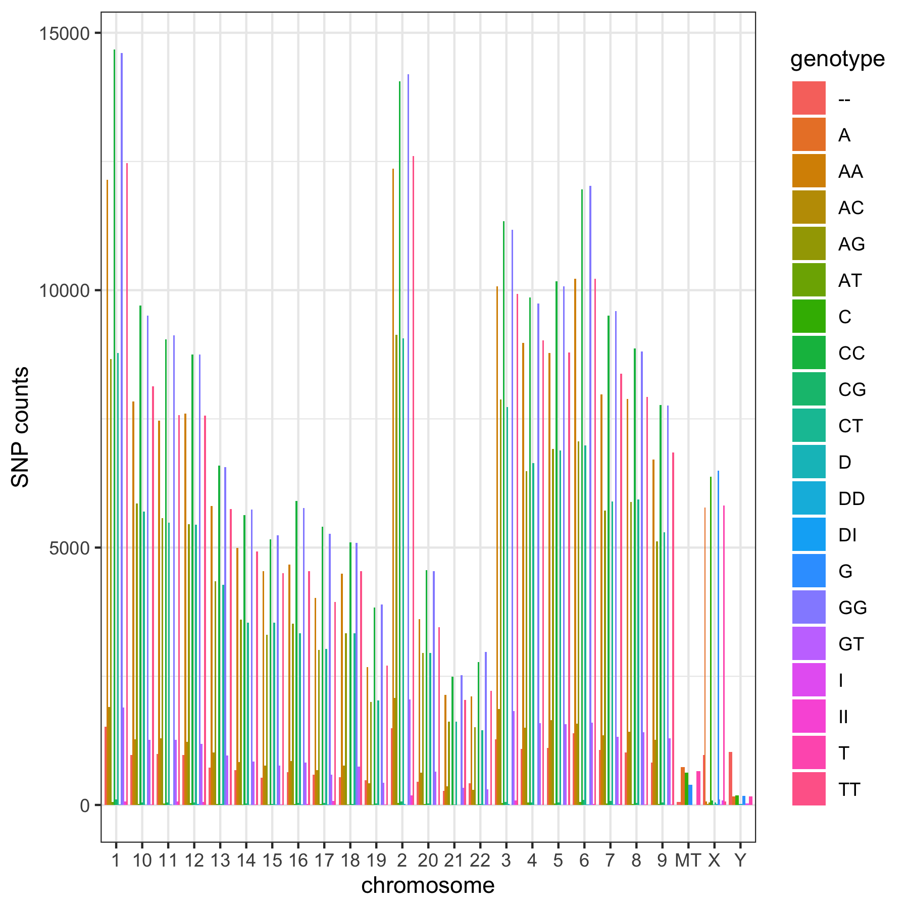

```{r}
library(ggplot2)
SNP_table <- read.table("23andMe_complete.txt", header = TRUE, sep = "\t")
```


#Exercise 1
Add title and labels for the x and y axis to Lab3 ex1. Color the bars blue

```{r}
ggplot(SNP_table, aes(chromosome)) + geom_bar(fill= "blue") + 
  xlab("Total chromosomes") + ylab ("SNP counts")+
  ggtitle("Barplot of total SNPS across chromosomes")
```

#Exercise 2
To Lab3 ex3 add more defined x and y axis labels, add a title, Change the colors of the genotypes, so that the dinucleotides (e.g. AA) are one color, the mononucleotides (A) are another and D’s and I’s a third color. One way to do this is to specify the color of each genotype.
```{r}
p= ggplot(SNP_table, aes(chromosome, fill = genotype)) +
  geom_bar() + ylab ("SNP counts") + theme_bw()

mycol<- c("AA" = "red", "AC"="red", "AG" = "red", "AT" ="red", "CC"= "red", "CG" ="red", "CT" ="red", "TT" = "red", "GG" ="red", "GT" ="red", "DD" = "blue", "II" = "blue", "DI" = "blue","D"= "blue",  "I" = "blue", "A" = "purple", "C" = "purple", "T" = "purple", "G" = "purple", "--" = "blue")

#totcol<- c(mycol1, mycol2, mycol3)
 ggplot(SNP_table, aes(chromosome, fill = genotype)) +
  geom_bar() + ylab ("SNP counts") + theme_bw()+
   xlab("Total chromosomes")+ ylab("SNP count by genotype") + scale_fill_manual(values=mycol)
  
```

#Exercise 3
From Lab3 ex5, make an output png file, then load the file into report using the RMarkdown or html format.
```{r}
ppi<- 300
png("SNP_plot.png", width=6*ppi, height=6*ppi, res=ppi)
print(ggplot(SNP_table, aes(chromosome, fill = genotype)) +
  geom_bar(position = "dodge") + ylab ("SNP counts")+ theme_bw())
dev.off()

```


```{r, echo=FALSE}
#setting echo=FALSE was used to prevent the code chunk from showing when knitted

##inserting images into RMarkdown
# This is the RMarkdown style for inserting images
# Your image must be in your working directory
# This command is put OUTSIDE the r code chunk

# 


# This is an alternative way using html. 
# Remember that it must be in your working directory or you will need to specify the full path.
# The html is put OUTSIDE the r code chunk.

#
```

 

Exercise 4
For Lab3 ex6 add more defined x and y axis labels, add a title, make the x-axis for each graph readable in your final report file.
```{r}

p<- ggplot(SNP_table, aes(chromosome, fill = genotype)) +
  geom_bar(position = "dodge") + xlab("chromosome type") + ylab ("SNP genotype counts")+ theme_bw() + facet_wrap(~genotype)
p
```


Exercise 5
Turn Lab3 ex6 into an interactive graph using plotly

```{r}
library(plotly)
p<- ggplot(SNP_table, aes(chromosome, fill = genotype)) +
  geom_bar(position = "dodge") + xlab("chromosome type") + ylab ("SNP genotype counts") + theme_bw() + facet_wrap(~genotype)

ggplotly(p)
```


Exercise 6
Make an interactive table of the SNPS found in on the Y chromosome from the 23andMe_complete data set
```{r}
library(DT)

df_interact <- datatable(filter(SNP_table, SNP_table$chromosome=="Y")) 
df_interact
```

